# Iudicium Architecture Documentation

> **Location:** `docs/ARCHITECTURE.md`

This document provides a comprehensive overview of the Iudicium system architecture, including database schema, component relationships, and data flow diagrams.

## Table of Contents

- [Database ERD](#database-erd)
- [System Architecture](#system-architecture)
- [Backend Component Diagram](#backend-component-diagram)
- [Frontend Component Diagram](#frontend-component-diagram)
- [Data Flow Diagram](#data-flow-diagram)
- [API Architecture](#api-architecture)

---

## Database ERD

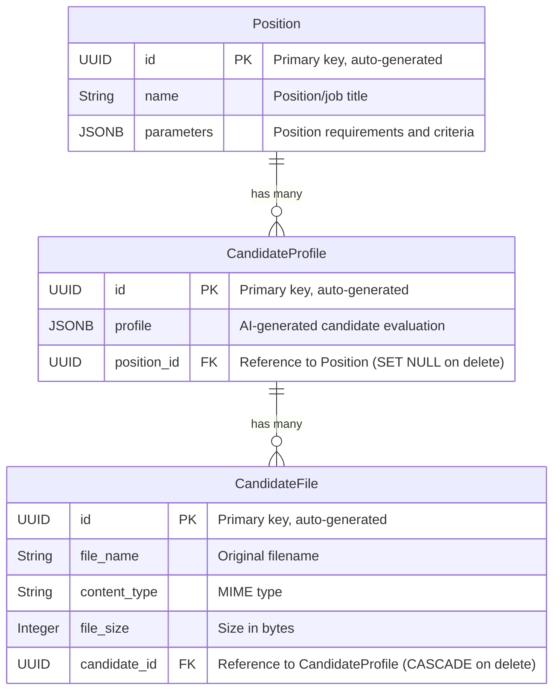

### Profile JSONB Structure

The `profile` field in `CandidateProfile` contains a structured JSON document:

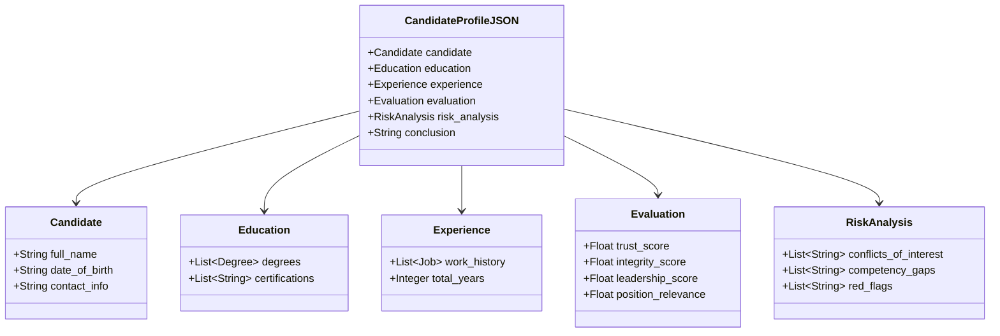

### Position Parameters JSONB Structure

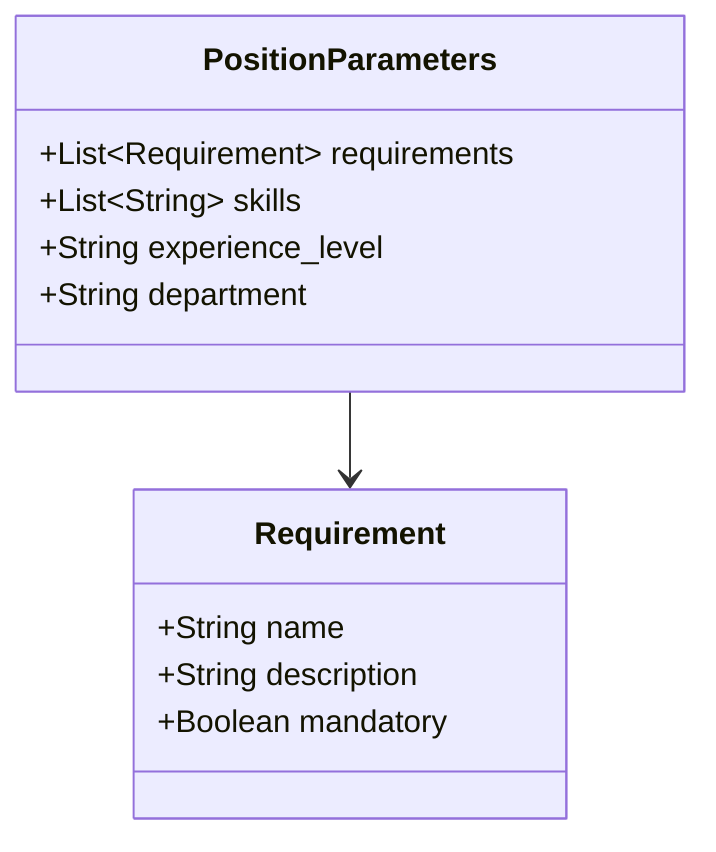

---

## System Architecture

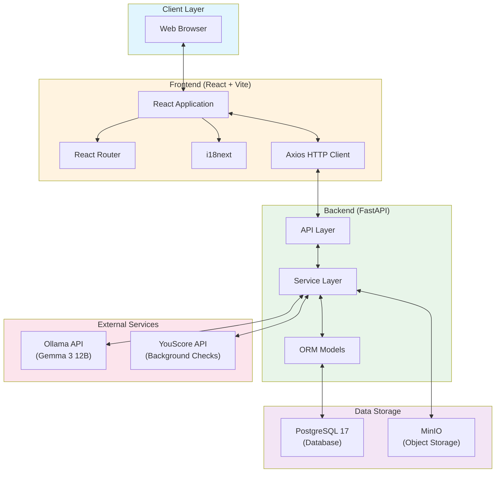

---

## Backend Component Diagram

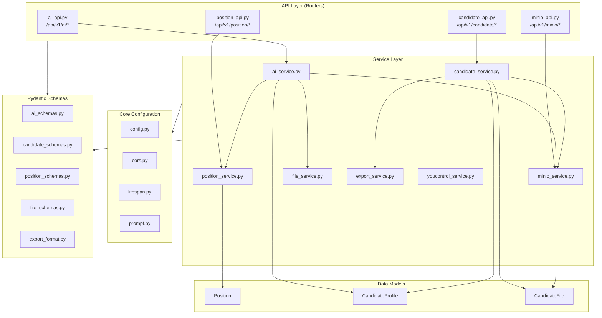

---

## Frontend Component Diagram

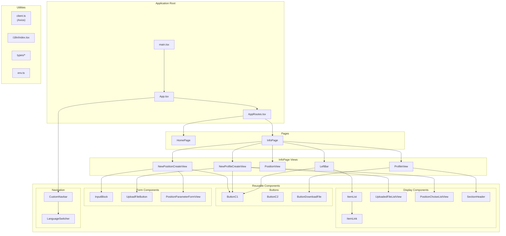

---

## Data Flow Diagram

### Candidate Evaluation Flow

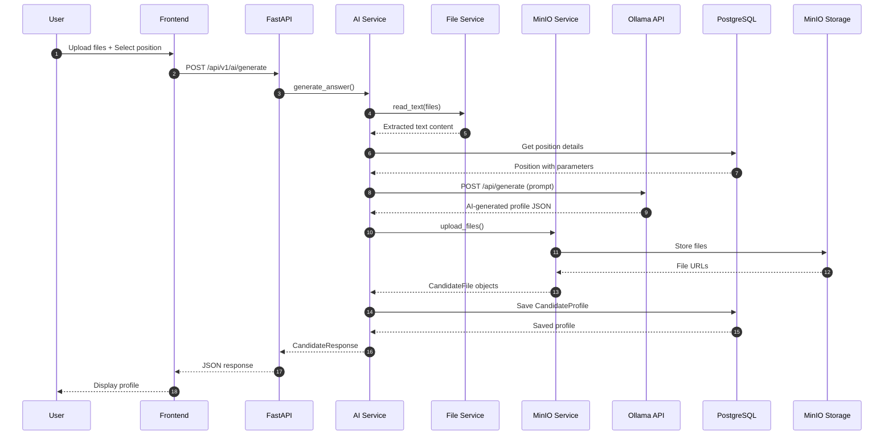

### Position Creation Flow

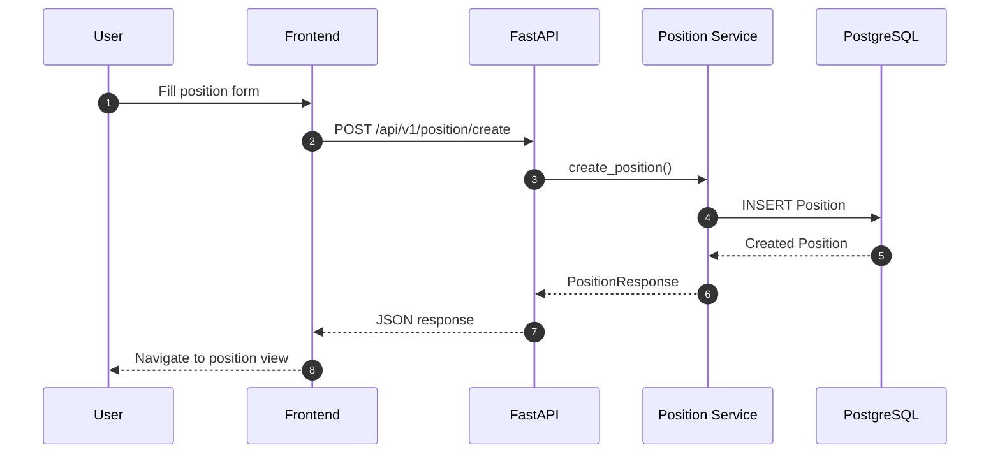

### Export Flow

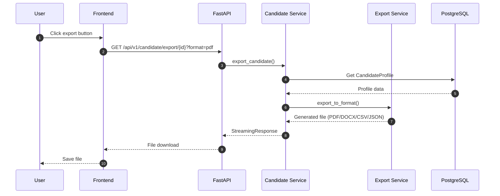

---

## API Architecture

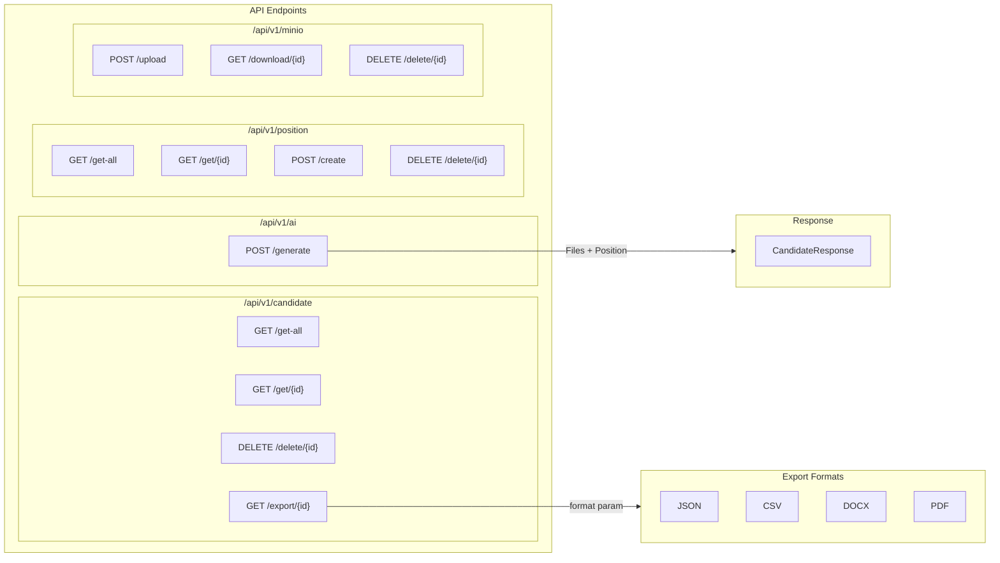

---

## Technology Stack

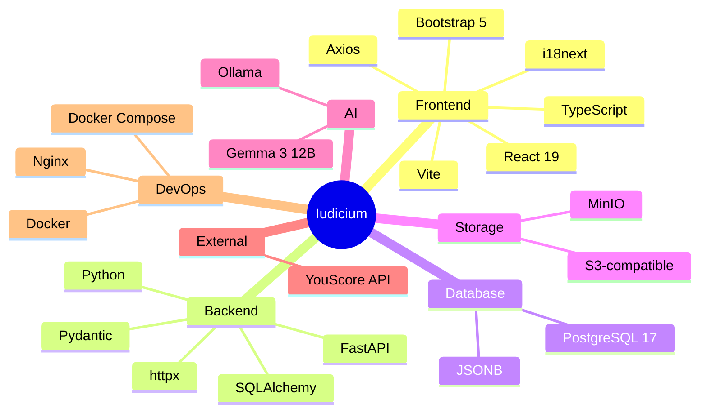

---

## Deployment Architecture

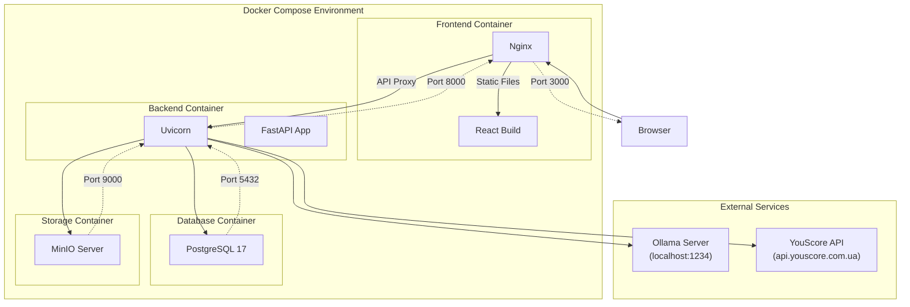
